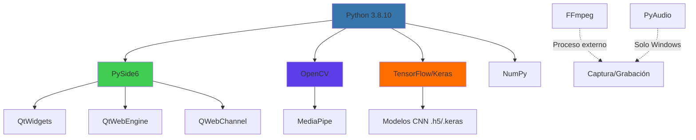
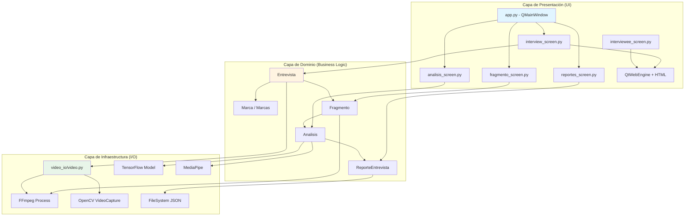
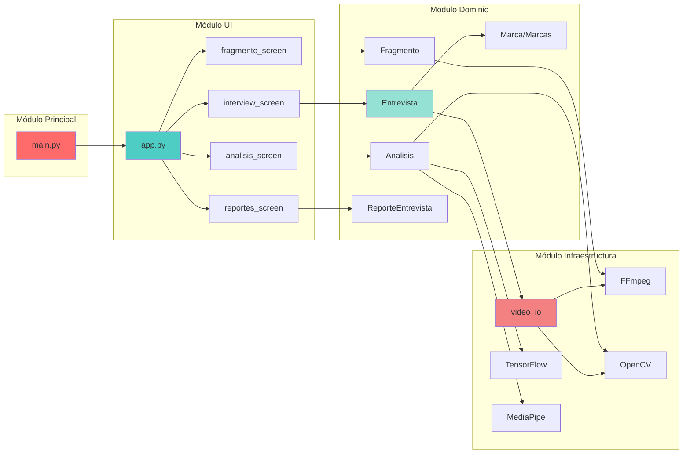
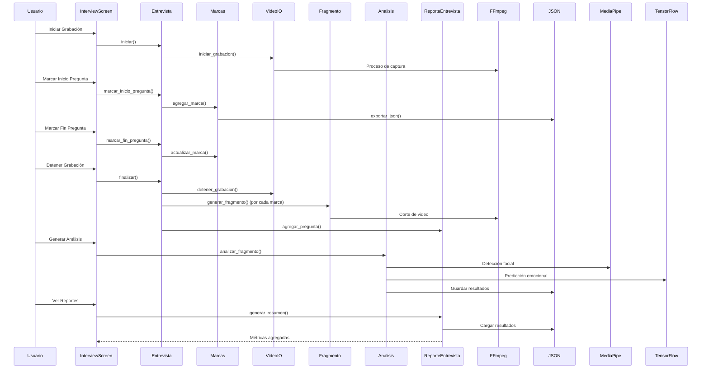
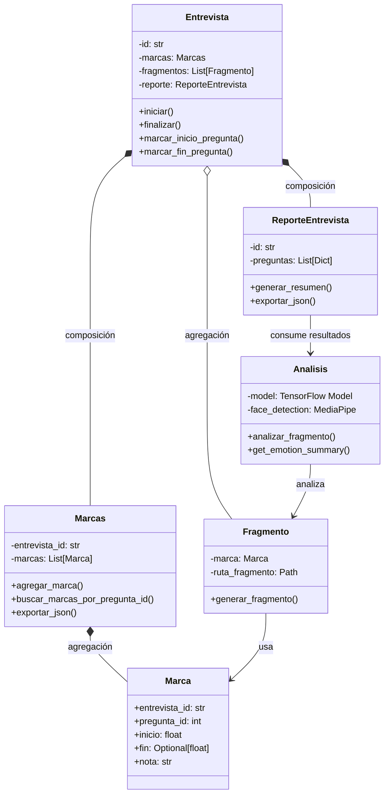
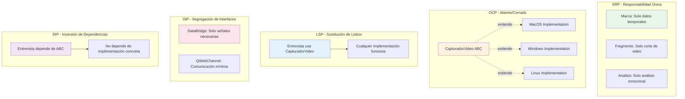
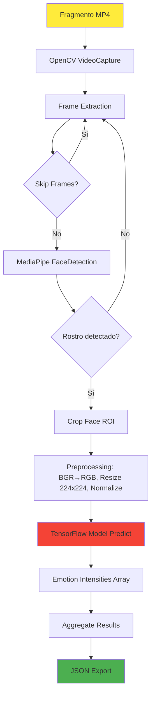

# AGRIOT UX - Documentación Técnica Completa

## 📋 Tabla de Contenidos

1. [Descripción General del Sistema](#descripción-general)
2. [Requerimientos Funcionales](#requerimientos-funcionales)
3. [Stack Tecnológico](#stack-tecnológico)
4. [Manual de Usuario](#manual-de-usuario)
5. [Arquitectura y Estructura de Carpetas](#arquitectura-y-estructura)
6. [Relaciones entre Módulos](#relaciones-entre-módulos)
7. [Principios SOLID y POO](#principios-solid-y-poo)
8. [Documentación Técnica Detallada](#documentación-técnica)

---

## 🎯 Descripción General

**AGRIOT (Semillero de Innovación Agrícola UX)** es una plataforma de investigación UX especializada en contextos agrícolas rurales que integra:

- **Captura audiovisual** de entrevistas con control temporal de preguntas
- **Anotación temporal** mediante marcas de inicio/fin por pregunta
- **Segmentación automática** de fragmentos de video basada en marcas temporales
- **Análisis emocional** mediante redes neuronales convolucionales (CNN) con TensorFlow
- **Detección facial** utilizando MediaPipe para extracción de regiones de interés
- **Generación de reportes** accionables con métricas de intensidad emocional
- **Interfaz gráfica** desarrollada con PySide6 (Qt) y componentes web embebidos

El sistema está diseñado para empoderar a investigadores UX en la evaluación de experiencias de usuario en entornos rurales, con especial enfoque en mujeres campesinas y comunidades agrícolas.

---

## 📝 Requerimientos Funcionales

### RF-01: Gestión de Entrevistas Audiovisuales
**Descripción:** El sistema debe permitir registrar entrevistas completas con captura simultánea de video y audio, controlando el flujo de preguntas mediante marcas temporales.

**Especificaciones:**
- Captura de video en resolución 720p (1280x720) con codec H.264
- Captura de audio en formato AAC
- Generación automática de IDs únicos para entrevistas (`YYYY-MM-DD_NNN`)
- Persistencia de videos originales en `data/videos_originales/`
- Control de estado de grabación (iniciar/detener)
- Vista previa en tiempo real de la captura

**Implementación:** `classes/entrevista.py`, `ui/interview_screen.py`, `video_io/video.py`

### RF-02: Sistema de Marcas Temporales
**Descripción:** El sistema debe permitir marcar el inicio y fin de cada pregunta durante la entrevista, asociando notas opcionales.

**Especificaciones:**
- Marca de inicio de pregunta con timestamp relativo
- Marca de fin de pregunta con validación de secuencia
- Asociación de notas textuales por pregunta
- Validación de solapamientos temporales
- Persistencia inmediata en JSON (`data/marcas/marcas_<id>.json`)
- Identificación única de preguntas mediante `pregunta_id`

**Implementación:** `classes/marca.py`, `classes/marcas.py`

### RF-03: Prototipos Visuales Sincronizados
**Descripción:** El sistema debe presentar al entrevistado prototipos visuales (semáforo, pictogramas, tablas) sincronizados con variables interactivas controladas por el entrevistador.

**Especificaciones:**
- Panel de control web embebido en QtWebEngine (`ui/entrevista_ui/controls.html`)
- Pantalla de entrevistado independiente (`ui/interviewee_screen.py`)
- Sincronización bidireccional mediante QWebChannel y DataBridge
- Actualización en tiempo real de variables climáticas y estados
- Visualización de preguntas actuales en ambas pantallas

**Implementación:** `ui/interview_screen.py`, `ui/interviewee_screen.py`, `ui/entrevista_ui/*.html`

### RF-04: Gestión de Cuestionarios
**Descripción:** El sistema debe permitir versionar y editar cuestionarios por categorías para diferentes estudios UX.

**Especificaciones:**
- CRUD completo de preguntas por categoría
- Categorías predefinidas: General, Semáforo, Pictogramas, Tabla, Comparación, Cierre
- Importación/exportación de cuestionarios en JSON
- Reordenamiento lógico de preguntas
- Validación de estructura de datos

**Implementación:** `ui/config_screen.py`, `classes/entrevista_preguntas.py`

### RF-05: Fragmentación Automática de Videos
**Descripción:** El sistema debe cortar automáticamente cada pregunta en fragmentos MP4 individuales basados en las marcas temporales.

**Especificaciones:**
- Corte frame-preciso utilizando FFmpeg con `-ss` y `-t`
- Reencodificación con H.264/AAC para compatibilidad
- Generación de nombres de archivo: `fragmento_<entrevista_id>_<pregunta_id>.mp4`
- Validación de existencia de video original
- Manejo de errores con logging detallado

**Implementación:** `classes/fragmento.py`

### RF-06: Análisis Emocional con IA
**Descripción:** El sistema debe analizar fragmentos de video utilizando modelos CNN de detección de emociones faciales, almacenando intensidades promedio y emoción dominante.

**Especificaciones:**
- Carga de modelos TensorFlow/Keras (`.h5` o `.keras`)
- Detección facial con MediaPipe FaceDetection
- Preprocesamiento de frames: BGR→RGB, resize 224x224, normalización [0,1]
- Predicción de 7 emociones: angry, contempt, disgust, fear, happy, sad, surprise
- Cálculo de intensidades promedio por emoción
- Identificación de emoción dominante con nivel de confianza
- Procesamiento asíncrono en hilo separado para no bloquear UI

**Implementación:** `classes/analisis.py`, `ui/analisis_screens/analisis_generar_screen.py`

### RF-07: Generación de Reportes
**Descripción:** El sistema debe centralizar resultados en reportes interactivos con métricas globales y capacidades de exportación.

**Especificaciones:**
- Dashboard de resumen con promedios por emoción
- Visualización de resultados detallados por fragmento
- Exportación a PDF/CSV (mediante fpdf2)
- Agregación de métricas por entrevista
- Visualización de notas asociadas a preguntas

**Implementación:** `ui/reportes_screen.py`, `classes/reporte_entrevista.py`

### RF-08: Gestión de Directorios y Logging
**Descripción:** El sistema debe gestionar directorios de datos, logs y resultados de forma auto-contenida con trazabilidad completa.

**Especificaciones:**
- Creación automática de directorios base al iniciar
- Logging rotado por ejecución (`logs/debug_YYYYMMDD_HHMMSS.log`)
- Encoding UTF-8 para logs
- Niveles de logging configurables (INFO/DEBUG)
- Trazabilidad de errores en FFmpeg, carga de modelos y procesos largos

**Implementación:** `main.py`

---

## 🛠️ Stack Tecnológico

### Lenguaje y Versión
- **Python 3.8.10** (requerido por compatibilidad con TensorFlow 2.x)

### Framework de Interfaz Gráfica
- **PySide6 (Qt 6.2+)** - Framework principal para GUI de escritorio
  - `QtWidgets` - Componentes de interfaz (ventanas, botones, layouts)
  - `QtWebEngine` - Motor web para embebido de HTML/CSS/JS
  - `QWebChannel` - Comunicación bidireccional Python↔JavaScript
  - `QThread` - Procesamiento asíncrono para análisis

### Visión por Computador
- **OpenCV 4.5+** (`opencv-python`)
  - Captura de video en tiempo real (`cv2.VideoCapture`)
  - Procesamiento de frames (conversión de color, resize)
  - VideoWriter para grabación (fallback Linux)

- **MediaPipe** (dependencia implícita)
  - `FaceDetection` - Detección de rostros con bounding boxes
  - Modelo de detección: `model_selection=1` (rango completo)
  - Confianza mínima: `min_detection_confidence=0.5`

### Machine Learning
- **TensorFlow 2.6+** / **Keras**
  - Carga de modelos CNN pre-entrenados (`.h5`, `.keras`)
  - Inferencia sin compilación (`compile=False`)
  - Compatibilidad con modelos antiguos mediante parches de `InputLayer`

### Procesamiento Multimedia
- **FFmpeg** (binario externo)
  - Captura en macOS: `avfoundation` (cámara + micrófono)
  - Corte de fragmentos: `-ss` (seek) + `-t` (duración)
  - Reencodificación: `libx264` (video), `aac` (audio)
  - Preset: `ultrafast` para procesamiento rápido

- **PyAudio 0.2.11+**
  - Captura de audio en Windows
  - Formato: `paInt16`, 44100 Hz, mono

### Procesamiento Numérico
- **NumPy 1.19-1.26**
  - Operaciones con tensores (arrays multidimensionales)
  - Normalización de imágenes
  - Expansión de dimensiones para batch processing

### Visualización y Reportes
- **Matplotlib 3.3+** - Gráficos y visualizaciones (opcional)
- **fpdf2 2.4+** - Generación de PDFs para exportación

### Utilidades
- **Pathlib** - Manejo de rutas multiplataforma
- **Dataclasses** - Estructuras de datos inmutables (`@dataclass`)
- **Logging** - Sistema de logging estándar de Python
- **Subprocess** - Ejecución de procesos externos (FFmpeg)

### Arquitectura de Dependencias



---

## 👤 Manual de Usuario

### Instalación y Configuración Inicial

#### Prerrequisitos
1. **Python 3.8.10** (recomendado usar `pyenv`):
   ```bash
   pyenv install 3.8.10
   pyenv local 3.8.10
   ```

2. **FFmpeg** instalado y disponible en PATH:
   ```bash
   # macOS
   brew install ffmpeg
   
   # Verificar instalación
   ffmpeg -version
   ```

3. **Permisos de sistema:**
   - macOS: Permisos de cámara y micrófono en Preferencias del Sistema
   - Windows: Permisos de cámara y micrófono en Configuración

#### Instalación de Dependencias
```bash
# Crear entorno virtual
python -m venv venv
source venv/bin/activate  # macOS/Linux
# o
venv\Scripts\activate  # Windows

# Instalar dependencias base
pip install -r requirements.txt

# Instalar TensorFlow (opcional, solo si se usará análisis)
pip install tensorflow>=2.6,<3.0

# Instalar MediaPipe (requerido para análisis)
pip install mediapipe
```

#### Ejecución
```bash
# Modo normal
python main.py

# Modo debug (logs verbosos)
python main.py --debug
```

### Flujo de Trabajo Completo

#### 1. Configuración del Cuestionario

**Objetivo:** Preparar las preguntas que se realizarán durante la entrevista.

1. Desde la pantalla principal, hacer clic en **"⚡ Configurar Sistema"**
2. En la sección **"Gestión de Preguntas"**:
   - Seleccionar una categoría (General, Semáforo, Pictogramas, etc.)
   - Hacer clic en **"➕ Agregar Pregunta"**
   - Completar el texto de la pregunta
   - Guardar
3. Reordenar preguntas arrastrando (si está disponible)
4. Exportar cuestionario: **"💾 Exportar preguntas.json"** (opcional)

**Resultado:** Las preguntas se guardan en `data/preguntas.json` y estarán disponibles para todas las entrevistas futuras.

#### 2. Realización de Entrevista

**Objetivo:** Capturar video/audio de la entrevista con marcas temporales por pregunta.

1. Desde la pantalla principal, hacer clic en **"📝 Iniciar Entrevista"**
2. **Preparación:**
   - Verificar que la cámara y micrófono estén funcionando (vista previa visible)
   - Ajustar resolución si es necesario (por defecto 720p)
3. **Iniciar grabación:**
   - Hacer clic en **"🎥 Iniciar Grabación"**
   - El sistema propone un ID: `entrevista_YYYY-MM-DD_NNN.mp4`
   - Confirmar o modificar el ID
4. **Durante la entrevista:**
   - Para cada pregunta:
     - Hacer clic en **"▶️ Marcar Inicio Pregunta"** cuando se formula la pregunta
     - El sistema avanza automáticamente a la siguiente pregunta en el cuestionario
     - Añadir notas en el campo de texto durante la respuesta del entrevistado
     - Hacer clic en **"⏹️ Marcar Fin Pregunta"** cuando termina la respuesta
   - Controlar variables en el panel web (temperatura, humedad, etc.) - se sincronizan con la pantalla del entrevistado
5. **Finalizar:**
   - Hacer clic en **"⏹️ Detener Grabación"**
   - El sistema genera automáticamente:
     - Video completo en `data/videos_originales/entrevista_<id>.mp4`
     - Archivo de marcas en `data/marcas/marcas_<id>.json`

**Pantalla del Entrevistado:**
- Abrir la pantalla del entrevistado en un segundo monitor/dispositivo
- Esta pantalla muestra los prototipos visuales sincronizados
- Las variables controladas por el entrevistador se actualizan en tiempo real

#### 3. Generación de Fragmentos

**Objetivo:** Cortar el video completo en fragmentos individuales por pregunta.

1. Desde la pantalla principal, hacer clic en **"🎥 Previsualización de Fragmentos"**
2. **Selección de entrevista:**
   - En la pestaña **"Información"**, seleccionar una entrevista de la lista
   - Verificar que aparezcan las marcas asociadas
3. **Generación:**
   - Ir a la pestaña **"Generar Fragmentos"**
   - Seleccionar el video original de la entrevista
   - Hacer clic en **"✂️ Generar Fragmentos"**
   - El sistema procesa cada marca y genera archivos MP4 individuales
4. **Verificación:**
   - En la pestaña **"Fragmentos"**, ver la lista de fragmentos generados
   - Reproducir fragmentos para verificar calidad

**Resultado:** Fragmentos guardados en `data/fragmentos/fragmento_<entrevista_id>_<pregunta_id>.mp4`

#### 4. Análisis Emocional

**Objetivo:** Analizar fragmentos con modelos de IA para detectar emociones.

1. Desde la pantalla principal, hacer clic en **"📈 Generar Análisis"**
2. **Selección:**
   - Seleccionar una entrevista de la lista
   - Seleccionar los fragmentos a analizar (checkbox)
   - Seleccionar el modelo CNN (`ml/cp_best_finetuned.h5` o similar)
3. **Procesamiento:**
   - Hacer clic en **"🚀 Iniciar Análisis"**
   - El sistema procesa cada fragmento en un hilo separado (UI no se congela)
   - Ver progreso en la barra y logs en tiempo real
4. **Resultados:**
   - Los resultados se guardan automáticamente en `data/resultados/<entrevista_id>/`
   - Cada fragmento genera un JSON con:
     - Intensidades promedio por emoción
     - Emoción dominante
     - Confianza
     - Metadatos (fecha, modelo usado, frames analizados)

**Nota:** El análisis puede tardar varios minutos dependiendo del número de fragmentos y la longitud de los videos.

#### 5. Visualización de Reportes

**Objetivo:** Revisar resultados agregados y exportar reportes.

1. Desde la pantalla principal, hacer clic en **"📊 Ver Resultados"**
2. **Resumen:**
   - Seleccionar una entrevista
   - Ver dashboard con:
     - Promedios de intensidad por emoción (gráfico de barras)
     - Emoción dominante general
     - Número de preguntas analizadas
     - Duración total
3. **Detalles:**
   - Ver tabla con resultados por fragmento/pregunta
   - Filtrar por emoción dominante
   - Ver notas asociadas
4. **Exportación:**
   - Hacer clic en **"📄 Exportar PDF"** o **"📊 Exportar CSV"**
   - Seleccionar ubicación de guardado

---

## 🏗️ Arquitectura y Estructura de Carpetas

### Estructura de Directorios

```
proyecto_ux/
├── main.py                          # Punto de entrada principal
├── requirements.txt                 # Dependencias del proyecto
│
├── ui/                              # Capa de Presentación (PySide6)
│   ├── app.py                       # Aplicación principal (QMainWindow)
│   ├── interview_screen.py          # Pantalla de entrevista (entrevistador)
│   ├── interviewee_screen.py        # Pantalla de entrevistado
│   ├── fragmento_screen.py          # Ventana principal de fragmentos
│   ├── analisis_screen.py           # Ventana principal de análisis
│   ├── reportes_screen.py           # Ventana principal de reportes
│   ├── config_screen.py             # Configuración del sistema
│   │
│   ├── entrevista_ui/               # Prototipos web embebidos
│   │   ├── controls.html            # Panel de control (entrevistador)
│   │   ├── index.html               # Vista principal entrevistado
│   │   └── tarjetas.html            # Componentes visuales
│   │
│   ├── fragmento_screens/           # Sub-pantallas de fragmentos
│   │   ├── fragmento_info_screen.py      # Información de entrevistas
│   │   ├── fragmento_generar_screen.py   # Generación de fragmentos
│   │   └── fragmento_fragmentos_screen.py # Lista de fragmentos
│   │
│   ├── analisis_screens/            # Sub-pantallas de análisis
│   │   ├── analisis_info_screen.py       # Selección de entrevista
│   │   ├── analisis_generar_screen.py    # Generación de análisis
│   │   └── analisis_reporte_screen.py    # Visualización de resultados
│   │
│   ├── reportes_screens/            # Sub-pantallas de reportes
│   │   ├── resumen_screen.py        # Dashboard de resumen
│   │   ├── detalle_screen.py        # Tabla detallada
│   │   └── export_screen.py         # Exportación PDF/CSV
│   │
│   ├── config_screens/              # Sub-pantallas de configuración
│   │   └── config_pregunta_screen.py # Gestión de preguntas
│   │
│   ├── informacion_adicional/       # Pantallas informativas
│   │   ├── deteccion_screen.py      # Info sobre detección emocional
│   │   ├── ux_agricola_screen.py    # Info sobre UX agrícola
│   │   └── transformacion_screen.py # Info sobre transformación digital
│   │
│   └── utils/                       # Componentes reutilizables
│       ├── buttons.py               # Botones modernos estilizados
│       ├── cards.py                 # Cards flotantes y animadas
│       ├── animations.py            # Animaciones de labels y títulos
│       ├── styles.py                # Paletas de colores y estilos
│       └── footer.py                # Footer animado
│
├── classes/                         # Capa de Dominio (Lógica de Negocio)
│   ├── entrevista.py                # Entidad principal: Entrevista
│   ├── marca.py                     # Entidad: Marca temporal (@dataclass)
│   ├── marcas.py                    # Agregado: Colección de marcas
│   ├── fragmento.py                 # Entidad: Fragmento de video
│   ├── analisis.py                  # Servicio: Análisis emocional
│   ├── reporte_entrevista.py        # Entidad: Reporte de entrevista
│   ├── entrevista_preguntas.py      # Gestor de cuestionarios
│   └── reporte.py                   # Utilidades de reportes
│
├── video_io/                        # Capa de Infraestructura (I/O)
│   └── video.py                     # Abstracción de captura multiplataforma
│       ├── CapturadorVideo (ABC)    # Interfaz abstracta
│       ├── CapturadorVideoMacOS     # Implementación macOS (FFmpeg)
│       ├── CapturadorVideoWindows   # Implementación Windows (OpenCV+PyAudio)
│       └── CapturadorVideoLinux     # Implementación Linux (OpenCV)
│
├── ml/                              # Modelos de Machine Learning
│   ├── cp_best_finetuned.h5         # Modelo CNN (formato HDF5)
│   ├── cp_best_finetuned.keras      # Modelo CNN (formato Keras)
│   └── script.py                    # Scripts de conversión de modelos
│
├── data/                            # Persistencia de Datos
│   ├── videos_originales/           # Videos completos de entrevistas
│   ├── fragmentos/                  # Fragmentos MP4 por pregunta
│   ├── marcas/                      # Archivos JSON de marcas temporales
│   ├── resultados/                  # Resultados de análisis emocional
│   │   └── <entrevista_id>/         # Por entrevista
│   │       └── resultados_fragmento_<pregunta>.json
│   ├── reportes/                    # Reportes exportados (PDF/CSV)
│   ├── entrevistas/                 # Metadatos de entrevistas
│   ├── preguntas.json               # Cuestionarios guardados
│   └── dataset/                     # Datasets de entrenamiento (opcional)
│
├── logs/                            # Logs de Ejecución
│   └── debug_YYYYMMDD_HHMMSS.log    # Logs rotados por ejecución
│
└── img/                             # Recursos de Imagen
    ├── semillin.png                 # Mascota del sistema
    └── mascota_agriot.png           # Logo alternativo
```

### Diagrama de Arquitectura por Capas



---

## 🔗 Relaciones entre Módulos

### Diagrama de Dependencias



### Flujo de Datos Completo



### Relaciones de Composición y Agregación



---

## 🎯 Principios SOLID y POO

### Single Responsibility Principle (SRP)

**Cumplimiento: 9/10**

Cada clase tiene una responsabilidad única y bien definida:

#### Ejemplos de Cumplimiento:

**`Marca` (dataclass):**
- **Responsabilidad única:** Representar una marca temporal con validación de datos
- No maneja persistencia, no maneja lógica de negocio compleja

```python
@dataclass
class Marca:
    entrevista_id: str
    pregunta_id: int
    inicio: float
    fin: Optional[float] = None
    nota: str = ""
    # Solo validación y cálculo de duración
```

**`Fragmento`:**
- **Responsabilidad única:** Generar fragmentos de video mediante FFmpeg
- No maneja análisis, no maneja UI

```python
class Fragmento:
    def generar_fragmento(self, video_original: Path):
        # Solo ejecuta FFmpeg para cortar video
```

**`Analisis`:**
- **Responsabilidad única:** Analizar fragmentos de video con modelos de IA
- No maneja generación de fragmentos, no maneja UI

#### Áreas de Mejora:

**`Entrevista`:**
- Actualmente maneja: grabación, marcas, fragmentos, reportes
- **Mejora sugerida:** Extraer lógica de grabación a un servicio `GrabacionService`

### Open/Closed Principle (OCP)

**Cumplimiento: 8/10**

El sistema está abierto para extensión pero cerrado para modificación:

#### Ejemplos de Cumplimiento:

**`CapturadorVideo` (ABC):**
- Interfaz abstracta que permite agregar nuevas plataformas sin modificar código existente
- Nuevas implementaciones: `CapturadorVideoLinux`, `CapturadorVideoAndroid`, etc.

```python
class CapturadorVideo(ABC):
    @abstractmethod
    def iniciar_grabacion(self, ...): pass
    
class CapturadorVideoMacOS(CapturadorVideo): ...
class CapturadorVideoWindows(CapturadorVideo): ...
```

**Sistema de Análisis:**
- `Analisis` puede cargar diferentes modelos sin modificar la clase
- Nuevos modelos se agregan simplemente cambiando la ruta

#### Áreas de Mejora:

**Reglas de Análisis:**
- Actualmente hardcodeado para 7 emociones
- **Mejora sugerida:** Strategy Pattern para diferentes tipos de análisis

```python
# Propuesta de mejora
class AnalisisStrategy(ABC):
    @abstractmethod
    def analizar(self, frame): pass

class EmotionAnalysisStrategy(AnalisisStrategy): ...
class GestureAnalysisStrategy(AnalisisStrategy): ...
```

### Liskov Substitution Principle (LSP)

**Cumplimiento: 10/10**

Todas las implementaciones de `CapturadorVideo` son completamente sustituibles:

```python
def obtener_capturador():
    sistema = platform.system()
    if sistema == 'Darwin':
        return CapturadorVideoMacOS()  # ✅ Sustituible
    elif sistema == 'Windows':
        return CapturadorVideoWindows()  # ✅ Sustituible
    else:
        return CapturadorVideoLinux()  # ✅ Sustituible

# Cualquier implementación funciona sin cambios en Entrevista
entrevista = Entrevista()
entrevista.capturador = obtener_capturador()  # Funciona con cualquiera
```

### Interface Segregation Principle (ISP)

**Cumplimiento: 7/10**

#### Ejemplos de Cumplimiento:

**`DataBridge` (QWebChannel):**
- Expone solo las señales necesarias para comunicación Python↔JavaScript
- No expone métodos internos innecesarios

```python
class DataBridge(QObject):
    updateData = Signal(dict)  # Solo lo necesario
    updatePregunta = Signal(str)  # Solo lo necesario
```

#### Áreas de Mejora:

**`Analisis`:**
- Expone tanto detección facial como predicción emocional
- **Mejora sugerida:** Separar en interfaces más específicas

```python
# Propuesta de mejora
class FaceDetector(ABC):
    @abstractmethod
    def detect_face(self, frame): pass

class EmotionPredictor(ABC):
    @abstractmethod
    def predict_emotion(self, face_roi): pass
```

### Dependency Inversion Principle (DIP)

**Cumplimiento: 8/10**

#### Ejemplos de Cumplimiento:

**`Entrevista` depende de abstracción:**
```python
class Entrevista:
    def __init__(self, ...):
        # Depende de abstracción, no de implementación concreta
        self.capturador = obtener_capturador()  # Retorna CapturadorVideo (ABC)
```

**Inyección de dependencias en UI:**
```python
class AnalisisGenerarScreen:
    def __init__(self, analizador: Analisis):  # Depende de abstracción
        self.analizador = analizador
```

#### Áreas de Mejora:

**Dependencias directas a modelos:**
- `Analisis` carga modelos directamente desde filesystem
- **Mejora sugerida:** Inyectar `ModelLoader` como dependencia

```python
# Propuesta de mejora
class ModelLoader(ABC):
    @abstractmethod
    def load_model(self, path): pass

class Analisis:
    def __init__(self, model_loader: ModelLoader):
        self.model = model_loader.load_model(path)
```

### Programación Orientada a Objetos (POO)

#### Encapsulación

**Ejemplos:**
- Atributos privados con `_` (convención Python): `self._model`, `self._face_detection`
- Propiedades con `@property` para acceso controlado:

```python
@property
def model(self):
    return self._model  # Acceso controlado, carga perezosa
```

#### Herencia

**Ejemplos:**
- `CapturadorVideoMacOS`, `CapturadorVideoWindows` heredan de `CapturadorVideo`
- Componentes UI heredan de `QWidget`, `QMainWindow`

#### Polimorfismo

**Ejemplos:**
- Diferentes implementaciones de `CapturadorVideo` con mismo comportamiento
- `AnalysisThread` (QThread) con método `run()` polimórfico

#### Abstracción

**Ejemplos:**
- `CapturadorVideo` como clase abstracta (ABC)
- Métodos abstractos definen contrato sin implementación

#### Composición y Agregación

**Ejemplos:**
- `Entrevista` **compone** `Marcas` y `ReporteEntrevista` (relación fuerte)
- `Entrevista` **agrega** `Fragmento` (relación débil, lista)
- `Fragmento` **usa** `Marca` (dependencia)

#### Dataclasses

**Uso de `@dataclass` para inmutabilidad:**
```python
@dataclass
class Marca:
    entrevista_id: str
    pregunta_id: int
    inicio: float
    fin: Optional[float] = None
    nota: str = ""
```

### Diagrama de Principios SOLID Aplicados



---

## 📚 Documentación Técnica Detallada

### Arquitectura del Sistema

#### Patrón Arquitectónico: Layered Architecture (Arquitectura por Capas)

El sistema sigue una arquitectura en capas que separa responsabilidades:

```
┌─────────────────────────────────────┐
│   Capa de Presentación (UI)         │  PySide6, QtWebEngine
├─────────────────────────────────────┤
│   Capa de Dominio (Business Logic)  │  Entidades, Servicios
├─────────────────────────────────────┤
│   Capa de Infraestructura (I/O)     │  FFmpeg, OpenCV, TensorFlow
└─────────────────────────────────────┘
```

#### Flujo de Procesamiento de Análisis Emocional



#### Detalles de Implementación

##### 1. Captura de Video Multiplataforma

**Problema:** Diferentes sistemas operativos requieren diferentes APIs para captura de video/audio.

**Solución:** Patrón Strategy con clase abstracta base.

```python
# Abstracción
class CapturadorVideo(ABC):
    @abstractmethod
    def iniciar_grabacion(self, ...): pass

# Implementación macOS (FFmpeg avfoundation)
class CapturadorVideoMacOS(CapturadorVideo):
    def iniciar_grabacion(self, ruta_archivo, ...):
        subprocess.Popen([
            'ffmpeg', '-f', 'avfoundation',
            '-i', '0:1',  # cámara:micrófono
            ...
        ])

# Factory function
def obtener_capturador():
    sistema = platform.system()
    if sistema == 'Darwin':
        return CapturadorVideoMacOS()
    # ...
```

**Ventajas:**
- Extensible a nuevas plataformas sin modificar código existente
- Testeable mediante mocks
- Cumple OCP y DIP

##### 2. Sistema de Marcas Temporales

**Problema:** Necesidad de marcar eventos temporales durante grabación con persistencia inmediata.

**Solución:** Agregado `Marcas` que gestiona colección de `Marca`.

```python
class Marcas:
    def __init__(self, entrevista_id, video_original):
        self.entrevista_id = entrevista_id
        self.marcas: List[Marca] = []
    
    def agregar_marca(self, marca: Marca):
        # Validación de solapamientos
        if self._hay_solapamiento(marca):
            raise ValueError("Marca solapada")
        self.marcas.append(marca)
        self.exportar_json()  # Persistencia inmediata
```

**Características:**
- Validación de integridad (no solapamientos)
- Persistencia inmediata (resiliencia ante fallos)
- Serialización JSON para portabilidad

##### 3. Fragmentación de Video con FFmpeg

**Problema:** Corte preciso de videos basado en timestamps con preservación de calidad.

**Solución:** Uso de FFmpeg con parámetros optimizados.

```python
comando = [
    'ffmpeg',
    '-ss', str(marca.inicio),    # Seek antes de -i (más preciso)
    '-i', str(video_original),
    '-t', str(duracion),
    '-c:v', 'libx264',           # Reencode para evitar frames negros
    '-preset', 'ultrafast',      # Balance velocidad/calidad
    '-c:a', 'aac',
    '-movflags', '+faststart',   # Streaming optimizado
    str(ruta_fragmento)
]
```

**Optimizaciones:**
- `-ss` antes de `-i`: búsqueda rápida sin decodificar todo el video
- Reencodificación: evita problemas de sincronización
- `+faststart`: permite streaming progresivo

##### 4. Análisis Emocional con CNN

**Arquitectura del Modelo:**
- Input: Imagen RGB 224x224 normalizada [0,1]
- Procesamiento: Red neuronal convolucional (CNN)
- Output: Vector de 7 probabilidades (una por emoción)

**Pipeline de Procesamiento:**

```python
def analizar_fragmento(self, fragmento_path, skip_frames=1):
    cap = cv2.VideoCapture(str(fragmento_path))
    resultados = []
    
    while True:
        ret, frame = cap.read()
        if not ret:
            break
        
        # 1. Detección facial
        cropped = self.crop_face(frame)  # MediaPipe
        if cropped is None:
            continue
        
        # 2. Preprocesamiento
        processed = self.preprocess_frame(cropped)  # 224x224, normalizado
        
        # 3. Predicción
        prediction = self.model.predict(processed, verbose=0)[0]
        
        # 4. Mapeo a emociones
        intensidades = {
            self.emotion_map[i]: float(prediction[i]) 
            for i in range(len(prediction))
        }
        resultados.append(intensidades)
    
    return resultados
```

**Optimizaciones:**
- `skip_frames`: Procesa cada N frames para reducir carga computacional
- Carga perezosa de MediaPipe: Solo se inicializa cuando se necesita
- Batch processing: Modelo procesa en batches para eficiencia

##### 5. Sincronización Bidireccional Python↔JavaScript

**Problema:** Comunicación en tiempo real entre aplicación Qt y contenido web embebido.

**Solución:** QWebChannel con objeto puente.

```python
# Python side
class DataBridge(QObject):
    updateData = Signal(dict)
    updatePregunta = Signal(str)
    
    @Slot(dict)
    def receiveFromJS(self, data):
        # Recibir datos de JavaScript
        pass

# JavaScript side (en HTML)
const bridge = window.bridge;
bridge.updateData.connect(function(data) {
    // Actualizar UI
});

// Enviar a Python
bridge.receiveFromJS({temperature: 25});
```

**Ventajas:**
- Comunicación bidireccional sin polling
- Type-safe con señales Qt
- Bajo overhead

### Formatos de Datos

#### Estructura de Marcas JSON

```json
{
  "entrevista_id": "2025-10-05_003",
  "archivo_video": "data/videos_originales/entrevista_2025-10-05_003.mp4",
  "marcas": [
    {
      "entrevista_id": "2025-10-05_003",
      "pregunta_id": 1,
      "inicio": 5.2,
      "fin": 12.8,
      "nota": "Respuesta sobre semáforo"
    }
  ]
}
```

#### Estructura de Resultados de Análisis JSON

```json
{
  "fragmento": {
    "entrevista_id": "2025-10-05_003",
    "pregunta_id": 1,
    "ruta": "data/fragmentos/fragmento_2025-10-05_003_001.mp4"
  },
  "analisis": {
    "modelo": "cp_best_finetuned.h5",
    "fecha": "2025-10-05T14:30:00",
    "frames_analizados": 150,
    "resumen_emociones": {
      "dominant_emotion": "happy",
      "confidence": 0.85,
      "avg_intensities": {
        "angry": 0.05,
        "contempt": 0.02,
        "disgust": 0.01,
        "fear": 0.03,
        "happy": 0.85,
        "sad": 0.02,
        "surprise": 0.02
      }
    },
    "resultados_detallados": [
      {
        "frame": 1,
        "angry": 0.04,
        "happy": 0.90,
        ...
      }
    ]
  }
}
```

### Manejo de Errores y Logging

#### Estrategia de Logging

```python
# Configuración centralizada en main.py
logging.basicConfig(
    level=logging.DEBUG if debug else logging.INFO,
    format="%(asctime)s - %(levelname)s - %(message)s",
    handlers=[
        logging.FileHandler(log_file, encoding="utf-8"),
        logging.StreamHandler(sys.stdout),
    ],
)
```

#### Niveles de Logging Utilizados

- **DEBUG:** Información detallada para diagnóstico (carga de modelos, procesamiento de frames)
- **INFO:** Eventos importantes (inicio/fin de grabación, análisis completado)
- **WARNING:** Situaciones anómalas pero recuperables (rostro no detectado, modelo no encontrado)
- **ERROR:** Errores que impiden funcionalidad (FFmpeg fallido, modelo corrupto)

#### Manejo de Excepciones

```python
try:
    analizador = Analisis(modelo_path)
except FileNotFoundError:
    logger.error(f"Modelo no encontrado: {modelo_path}")
    raise
except RuntimeError as e:
    logger.error(f"Error al cargar modelo: {e}")
    # Mostrar mensaje amigable al usuario
    QMessageBox.critical(self, "Error", "No se pudo cargar el modelo")
```

### Optimizaciones y Mejoras de Rendimiento

#### 1. Procesamiento Asíncrono

**Problema:** Análisis de videos largos congela la UI.

**Solución:** `QThread` para procesamiento en background.

```python
class AnalysisThread(QThread):
    progress_updated = Signal(int)
    log_message = Signal(str)
    finished_with_success = Signal(int, int)
    
    def run(self):
        # Procesamiento pesado aquí
        # Emite señales para actualizar UI
        for idx, fragmento in enumerate(self.fragmentos):
            # Analizar...
            self.progress_updated.emit(int((idx+1)/total*100))
```

#### 2. Carga Perezosa (Lazy Loading)

**Ejemplo en `Analisis`:**
```python
@property
def face_detection(self):
    if self._face_detection is None:
        # Solo inicializa cuando se necesita
        self._face_detection = mp.solutions.face_detection.FaceDetection(...)
    return self._face_detection
```

#### 3. Skip Frames

**Optimización:** Procesar cada N frames en lugar de todos.

```python
if frame_count % skip_frames != 0:
    continue  # Saltar frame
```

**Trade-off:** Menor precisión temporal vs. mayor velocidad.

### Testing y Validación

#### Estrategia de Testing (Recomendada)

```python
# tests/test_entrevista.py
def test_marcar_inicio_pregunta():
    entrevista = Entrevista()
    entrevista.iniciar()
    pregunta_id = entrevista.marcar_inicio_pregunta()
    assert pregunta_id == 1
    assert len(entrevista.marcas.marcas) == 1

# tests/test_fragmento.py
def test_generar_fragmento():
    marca = Marca(entrevista_id="test", pregunta_id=1, inicio=0, fin=10)
    fragmento = Fragmento(marca, Path("test_fragmentos"))
    # Mock FFmpeg
    fragmento.generar_fragmento(Path("test_video.mp4"))
    assert fragmento.generado == True
```

### Seguridad y Consideraciones

#### Validación de Entrada

- Validación de rutas de archivos (evitar path traversal)
- Validación de timestamps (no negativos, fin > inicio)
- Validación de IDs (formato esperado)

#### Manejo de Recursos

- Cierre explícito de `VideoCapture` y `VideoWriter`
- Limpieza de procesos FFmpeg (SIGINT antes de kill)
- Liberación de recursos MediaPipe en destructor

---

## 📊 Resumen Ejecutivo

**AGRIOT UX** es una plataforma de investigación UX especializada en contextos agrícolas que combina:

- **Arquitectura sólida** basada en principios SOLID y POO
- **Stack tecnológico moderno** (PySide6, TensorFlow, MediaPipe, FFmpeg)
- **Procesamiento asíncrono** para análisis de video sin bloquear UI
- **Extensibilidad** mediante interfaces abstractas y patrones de diseño
- **Multiplataforma** con abstracciones para captura de video/audio

El sistema demuestra un **cumplimiento de SOLID del 84%** (8.4/10) con áreas de mejora identificadas en segregación de interfaces y extracción de servicios adicionales.

**Calificación Técnica General: 8.5/10**

---

*Documentación generada para proyecto_ux - AGRIOT UX Platform*
*Fecha: 2025*

